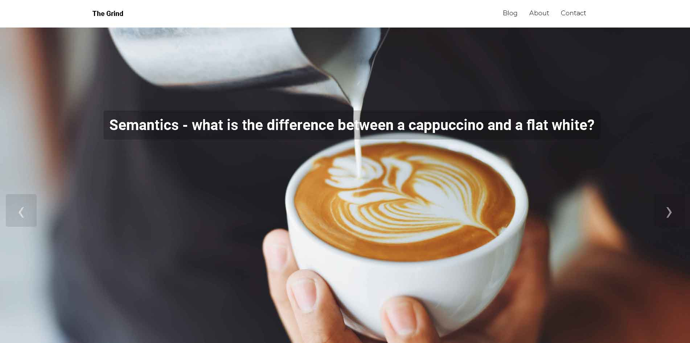
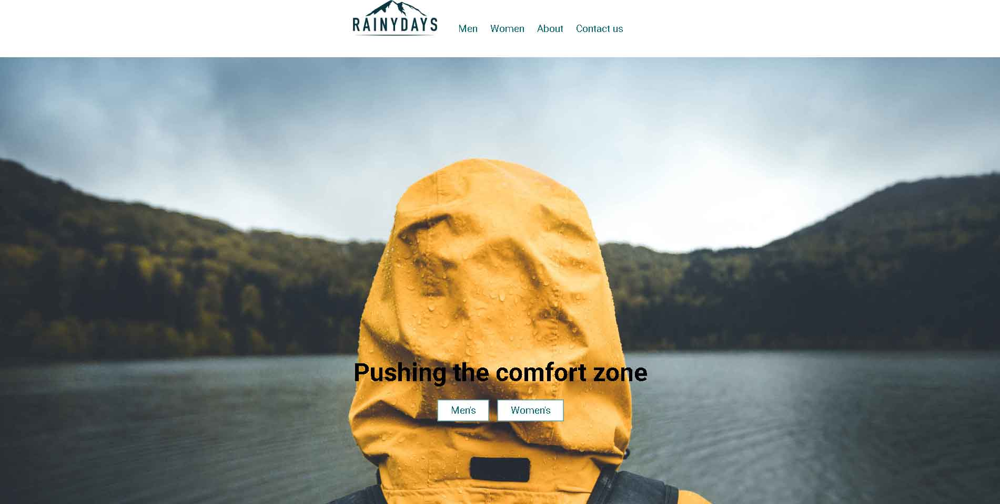
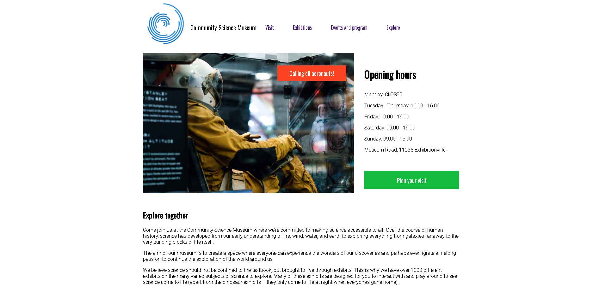

# Bjorn Arne Laeknes

My name is Bjørn Arne and I am a first year front-end dev. student at Noroff School of Technology and Digital Media in Norway.
I am really enjoying my journey to become a web-developer, learning to design and learning the tools to build things on my own excite me!

## Skills
HTML/CSS/JS

## Examples of work:

### Exam Project

Repo:
     https://github.com/Noroff-FEU-Assignments/project-exam-1-barlaek.git

Live site:
    https://glittering-mermaid-5b4ac1.netlify.app/blogpost.html?id=144

### Cross-course project

Repo:
    https://github.com/barlaek/cross-course-project-private.git

Live site:
    https://papaya-gingersnap-e82abf.netlify.app/

### Semester project

Repo:
    https://github.com/barlaek/Semester_project_csm_site.git

Live site:
    https://naughty-galileo-a835fc.netlify.app/
